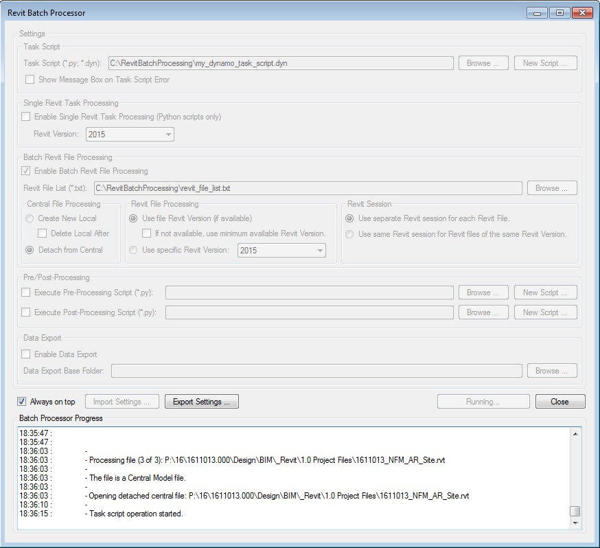

# Revit Batch Processor

Fully automated batch processing of Revit files with your own Python or Dynamo task scripts!



# Overview

Fully automated batch processing of Revit files with your own Python or Dynamo task scripts!

# Build & Installation Instructions

Open the solution file RevitBatchProcessor.sln in Visual Studio 2013 or later and run Build Solution (F6).

Revit addins will be automatically deployed to the Addins folder for each available Revit version [2015-2018]. e.g. %APPDATA%\Autodesk\Revit\Addins\2018

The BatchRvtGUI project is the GUI that drives the underlying engine (the BatchRvt project). Once built, run BatchRvtGUI.exe to start the Revit Batch Processor GUI.

# Features

- Batch processing of Revit files (.rvt and .rfa files) using either a specific version of Revit or a version that matches the version of Revit the file was saved in. Currently supports processing files in Revit versions 2015 through 2018. (Of course the required version of Revit must be installed!)
- Custom task scripts written in Python (specifically IronPython). These scripts of course have full access to the Revit API in addition to some batch processing-related information. They can even execute Dynamo scripts with just a small amount of python code! (See [Sample Scripts](#sample-scripts))
- Option to create a new Python task script at the click of a button that contains the minimal amount of code required for the custom task script to operate on an opened Revit file. The new task script can then easily be extended to do some useful work.
- Option for custom pre- and post-processing task scripts. Useful if the overall batch processing task requires some additional setup / tear down work to be done.
- Central file processing options (Create a new local file, Detach from central).
- Option to process files (of the same Revit version) in the same Revit session, or to process each file in its own Revit session. The latter is useful if Revit happens to crash during processing, since this won't block further processing.
- Automatic Revit dialog / message box handling. These, in addition to Revit error messages are handled and logged to the GUI console. This makes the batch processor very likely to complete its tasks without any user intervention required!
- Ability to import and export settings. This feature combined with a simple command line interface allows for batch processing tasks to be setup to run automatically on a schedule (using the Windows Task Scheduler) without the GUI.

# Requirements

- At least one version of Revit installed. Currently supports Revit versions 2015 through 2018.
- To build from source code, Visual Studio version 2013 or later.
- If executing Dynamo scripts from the task script, Dynamo 1.3+ installed (currently supports Revit versions 2016 through 2018). NOTE: The Dynamo script MUST have been saved with the 'Automatic' Run mode.

# License

This project is licensed under the terms of [The GNU General Public License v3.0](https://www.gnu.org/licenses/gpl.html)

Copyright (c) 2017  Daniel Rumery, BVN

This program is free software: you can redistribute it and/or modify
it under the terms of the GNU General Public License as published by
the Free Software Foundation, either version 3 of the License, or
(at your option) any later version.

This program is distributed in the hope that it will be useful,
but WITHOUT ANY WARRANTY; without even the implied warranty of
MERCHANTABILITY or FITNESS FOR A PARTICULAR PURPOSE.  See the
GNU General Public License for more details.

You should have received a copy of the GNU General Public License
along with this program.  If not, see <http://www.gnu.org/licenses/>.

# Credits

Daniel Rumery

# Contribute

<https://github.com/bvn-architecture/RevitBatchProcessor>

Feedback and suggestions for improvement are more than welcome! Please track and submit bugs via the Github Issues page. If you're feeling particularly adventurous you may even submit your own code via a Github pull request.

# Sample Scripts

'Hello World' task script:

```python
import clr
import System

clr.AddReference("RevitAPI")
clr.AddReference("RevitAPIUI")
from Autodesk.Revit.DB import *

import revit_script_util
from revit_script_util import Output

sessionId = revit_script_util.GetSessionId()
uiapp = revit_script_util.GetUIApplication()

# NOTE: these only make sense for batch Revit file processing mode.
doc = revit_script_util.GetScriptDocument()
revitFilePath = revit_script_util.GetRevitFilePath()

Output()
Output("Hello Revit world!")
```

Task script to execute a Dynamo script:

```python
import clr
import System

clr.AddReference("RevitAPI")
clr.AddReference("RevitAPIUI")
from Autodesk.Revit.DB import *

import revit_script_util
from revit_script_util import Output

import revit_dynamo_util

DYNAMO_SCRIPT_FILE_PATH = r"C:\DynamoScripts\MyDynamoWorkspace.dyn")

sessionId = revit_script_util.GetSessionId()
uiapp = revit_script_util.GetUIApplication()

# NOTE: these only make sense for batch Revit file processing mode.
doc = revit_script_util.GetScriptDocument()
revitFilePath = revit_script_util.GetRevitFilePath()

# Dynamo requires an active UIDocument, not just a loaded Document!
Output()
Output("Activating the document for Dynamo script automation.")
uidoc = uiapp.OpenAndActivateDocument(doc.PathName)

Output()
Output("Executing Dynamo script.")
revit_dynamo_util.ExecuteDynamoScript(uiapp, DYNAMO_SCRIPT_FILE_PATH)

Output()
Output("Finished Dynamo script.")
```

# Manual

Detailed instructions to come!

# Known Limitations / Issues

- Dynamo scripts executed from a task script MUST have been saved with the 'Automatic' Run mode. (Revit Batch Processor cannot execute Dynamo scripts saved in 'Manual' Run mode.)
- Executing Dynamo scripts from a task script requires that the Revit document is opened and active in the UI (See [Sample Scripts](#sample-scripts) for how to do this). Due to the context in which Revit Batch Processor operates within Revit, such active UI documents cannot be closed during the Revit session. Because of this, if many files are to be processed with a Dynamo script it is recommended to process them using the one-Revit-session-per-file option.

<!---

# Release Notes

[ TO DO ]

--->

