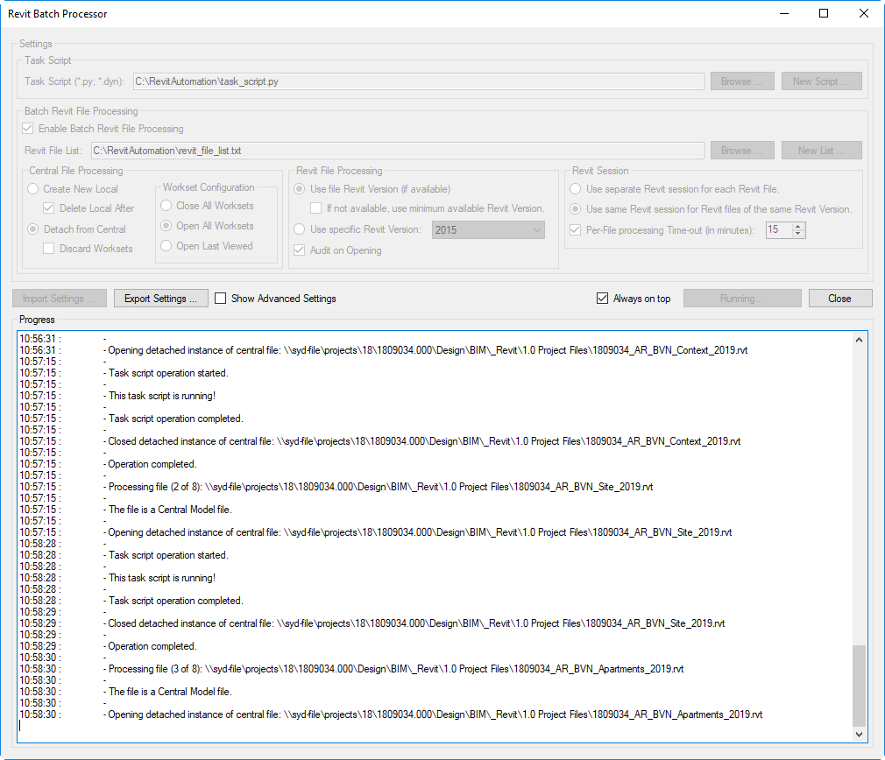

# Revit Batch Processor (RBP)

Fully automated batch processing of Revit files with your own Python or Dynamo task scripts!

## Latest version (NEW)

[Installer for Revit Batch Processor v1.6.0](https://github.com/bvn-architecture/RevitBatchProcessor/releases/download/v1.6.0-beta/RevitBatchProcessorSetup.exe)

Version 1.6.0 release is available, bringing support for **Revit 2021** and limited support for processing BIM360 cloud models!

See the [Releases](https://github.com/bvn-architecture/RevitBatchProcessor/releases) page for more information.

## RBP Sample Scripts

[Click here for some sample RBP python scripts maintained by Jan Christel (@jchristel)](https://github.com/jchristel/SampleCodeRevitBatchProcessor/)

Many thanks to Jan for authoring and making these RBP sample scripts public!

## FAQ

See the [Revit Batch Processor FAQ](https://github.com/bvn-architecture/RevitBatchProcessor/wiki/Revit-Batch-Processor-FAQ).

## Use cases

This tool doesn't _do_ any of these things, but it _allows_ you to do them:

- Open all the Revit files across your Revit projects and run a health-check script against them. Keeping an eye on the health and performance of many Revit files is time-consuming. You could use this to check in on all your files daily and react to problems before they get too gnarly.
- Perform project and family audits across your Revit projects.
- Run large scale queries against many Revit files.
- Mine data from your Revit projects for analytics or machine learning projects.
- Automated milestoning of Revit projects.
- Automated housekeeping tasks (e.g. place elements on appropriate worksets)
- Batch upgrading of Revit projects and family files.
- Testing your own Revit API scripts and Revit addins against a variety of Revit models and families in an automated manner.
- Essentially anything you can do to one Revit file with the Revit API or a Dynamo script, you can now do to many!



## Features

- Batch processing of Revit files (.rvt and .rfa files) using either a specific version of Revit or a version that matches the version of Revit the file was saved in. Currently supports processing files in Revit versions 2015 through 2020. (Of course the required version of Revit must be installed!)
- Custom task scripts written in Python or Dynamo! Python scripts have full access to the Revit API. Dynamo scripts can of course do whatever Dynamo can do :)
- Option to create a new Python task script at the click of a button that contains the minimal amount of code required for the custom task script to operate on an opened Revit file. The new task script can then easily be extended to do some useful work. It can even load and execute your existing functions in a C# DLL (see [Executing functions in a C# DLL](#executing-functions-in-a-c-dll)).
- Option for custom pre- and post-processing task scripts. Useful if the overall batch processing task requires some additional setup / tear down work to be done.
- Central file processing options (Create a new local file, Detach from central).
- Option to process files (of the same Revit version) in the same Revit session, or to process each file in its own Revit session. The latter is useful if Revit happens to crash during processing, since this won't block further processing.
- Automatic Revit dialog / message box handling. These, in addition to Revit error messages are handled and logged to the GUI console. This makes the batch processor very likely to complete its tasks without any user intervention required!
- Ability to import and export settings. This feature combined with the simple [command-line interface](#command-line-interface) allows for batch processing tasks to be setup to run automatically on a schedule (using the Windows Task Scheduler) without the GUI.
- Generate a .txt-based list of Revit model file paths compatible with RBP. The *New List* button in the GUI will prompt for a folder path to scan for Revit files. Optionally you can specify the type of Revit files to scan for and also whether to include subfolders in the scan.

## Unlimited Power

> "With great power come great responsibility"
[-- Spiderman](https://quoteinvestigator.com/2015/07/23/great-power/)

This tool enables you to do things with Revit files on a very large scale. Because of this ability, Python or Dynamo scripts that make modifications to Revit files (esp. workshared files) should be developed with the utmost care! You will need to be confident in your ability to write Python or Dynamo scripts that won't ruin your files en-masse. The Revit Batch Processor's 'Detach from Central' option should be used both while testing and for scripts that do not explicitly depend on working with a live workshared Central file.

# Build & Installation Instructions

## Installer

[Installer for Revit Batch Processor v1.6.0](https://github.com/bvn-architecture/RevitBatchProcessor/releases/download/v1.6.0-beta/RevitBatchProcessorSetup.exe)

The Revit Batch Processor (GUI) application will appear in the Start menu after the installation.

## Build from Source code

Open the solution file RevitBatchProcessor.sln in Visual Studio 2017 or later and run Build Solution (F6).

Revit addins will be automatically deployed to the Addins folder for each available Revit version [2015-2020]. e.g. %APPDATA%\Autodesk\Revit\Addins\2019

The BatchRvtGUI project is the GUI that drives the underlying engine (the BatchRvt project). Once built, run BatchRvtGUI.exe to start the Revit Batch Processor GUI.

When rebuilding, please make sure all Revit applications are closed before attempting the rebuild.

# Requirements

- At least one version of Revit installed. Currently supports Revit versions 2015 through 2020.
- To build from source code, Visual Studio version 2017 or later.
- If executing Dynamo scripts from the task script, Dynamo 1.3+ installed (currently supports Revit versions 2016 through 2020). NOTE: The Dynamo script MUST have been saved with the 'Automatic' Run mode. There **MUST BE EXACTLY ONE VERSION OF DYNAMO INSTALLED** for each version of Revit.
- If using an Excel file for the Revit File List, Microsoft Office / Excel installed.

# License

This project is licensed under the terms of [The GNU General Public License v3.0](https://www.gnu.org/licenses/gpl.html)

Copyright (c) 2020  Daniel Rumery, BVN

This program is free software: you can redistribute it and/or modify
it under the terms of the GNU General Public License as published by
the Free Software Foundation, either version 3 of the License, or
(at your option) any later version.

This program is distributed in the hope that it will be useful,
but WITHOUT ANY WARRANTY; without even the implied warranty of
MERCHANTABILITY or FITNESS FOR A PARTICULAR PURPOSE.  See the
GNU General Public License for more details.

You should have received a copy of the GNU General Public License
along with this program.  If not, see <http://www.gnu.org/licenses/>.

# Credits

Daniel Rumery [@DanRumery](https://github.com/DanRumery) (Original / Primary Author)
## Other Contributors (code)

- Vincent Cadoret [@vinnividivicci](https://github.com/vinnividivicci)
- Ryan Schwartz [@RyanSchw](https://github.com/RyanSchw)
- Dimitar Venkov [@dimven](https://github.com/dimven)

# Usage

The ***two ingredients*** you will need in order to use the Revit Batch Processor ("RBP") are:
- An **Excel (.xlsx) file** or **Text (.txt) file** that contains a list of Revit file paths. Each file path must be fully qualified (no partial paths).
  
  For an Excel file this means the first column of each row contains a file path.

  For a Text file this means each line contains a file path.
  
  For example:
  ```
  P:\15\ProjectABC\MainModel.rvt
  P:\16\ProjectXYZ\ModelA.rvt
  P:\16\ProjectXYZ\ModelB.rvt
  P:\16\ProjectXYZ\ConsultantModel.rvt
  ```

  NOTE: you can generate this list in .txt format using the *New List* button in the GUI. It will prompt you for a folder to scan for Revit files. Optionally you can specify the type of Revit files to scan for and also whether to include subfolders in the scan.

  *New in version 1.6+*

  There is limited support for processing files in BIM360. For BIM360-hosted files, use the following format instead:

  `<Revit version> <Project Guid> <Model Guid>`
  
  *Note: these three components must be separated by space(s) (not tabs!).*

  For example:
  ```
  2020 75b6464c-ba0f-4529-b049-0de9e473c2d6 0d54b8cc-3837-4df2-8c8e-0a94f4828868
  2020 c0dc2fda-fd34-42fe-8bb7-bd9f43841dbf d9f011d6-d52c-4c9f-9d7b-eb8388bd3ed0
  ```

  RBP is not able to detect the Revit version of cloud models hence why the Revit version is specified explicitly.

- A **Dynamo (.dyn)** or **Python (.py)** task script. This script will be executed once for each file in the list.

  For Dynamo scripts, **any workspace (.dyn) file should work** as a task script without modification. *(Indeed, if you find a script that works in Dynamo but not in RBP, [submit an Issue](https://github.com/bvn-architecture/RevitBatchProcessor/issues/new) to the RBP github page!)*

  For Python scripts (\*.py) they should contain at minimum the following code:
  ```python
  '''Output "Hello Revit world!" to the console / log.'''

  # This section is common to all Python task scripts. 
  import clr
  import System

  clr.AddReference("RevitAPI")
  clr.AddReference("RevitAPIUI")
  from Autodesk.Revit.DB import *

  import revit_script_util
  from revit_script_util import Output

  sessionId = revit_script_util.GetSessionId()
  uiapp = revit_script_util.GetUIApplication()

  doc = revit_script_util.GetScriptDocument()
  revitFilePath = revit_script_util.GetRevitFilePath()

  # The code above is boilerplate, everything below is all yours.
  # You can use almost any part of the Revit API here!

  Output()
  Output("Hello Revit world!")
  ```

# Executing functions in a C# DLL

Using a python task script it's quite easy to load and execute code in a C# DLL. When RBP runs the python task script, it adds the task script's folder path to the search paths so that if your DLL is in the same folder as your python task script you should be able to execute your functions as follows:

```python
# For example assume your DLL is called MyUtilities.dll and you have a static function called SomeClass.DoSomeWork() in namespace MyNameSpace:
# Assume this python script exists in the same folder as MyUtilities.dll.
clr.AddReference("MyUtilities")
from MyNameSpace import SomeClass

# Invoke your static function, passing in any parameters you need.
SomeClass.DoSomeWork(doc)
```

# Command-line Interface

Revit Batch Processor can be run from the command-line (bypassing the GUI). First configure and export the required processing settings from the GUI application. Once this is done you can simply run the command line utility **BatchRvt.exe** passing the exported settings file path as an argument:

```
%LOCALAPPDATA%\RevitBatchProcessor\BatchRvt.exe --settings_file "BatchRvt.Settings.json"
```

Optionally you can also specify the location for the log file:

```
%LOCALAPPDATA%\RevitBatchProcessor\BatchRvt.exe --log_folder "C:\MyBatchTasks\Logs" --settings_file "C:\MyBatchTasks\BatchRvt.Settings.json"
```

Alternatively, RBP can be run in batch processing mode without a settings file, using some basic arguments:

```
%LOCALAPPDATA%\RevitBatchProcessor\BatchRvt.exe --task_script MyDynamoWorkspace.dyn --file_list RevitFileList.xlsx --revit_version 2018
```

NOTE: this mode will operate in Detach mode when processing Central files. The **--revit_version** argument is optional here---if it is omitted then RBP will use the version of Revit that each Revit file was saved in.

To see help on all available command-line options use `--help`:

```
%LOCALAPPDATA%\RevitBatchProcessor\BatchRvt.exe --help
```

```
Help:

	Usage (using a settings file):

		BatchRvt.exe --settings_file <SETTINGS FILE PATH> [--log_folder <LOG FOLDER PATH>]

	Example:

		BatchRvt.exe --settings_file BatchRvt.Settings.json --log_folder .


	Usage (without a settings file):

		BatchRvt.exe --file_list <REVIT FILE LIST PATH> --task_script <TASK SCRIPT FILE PATH>

	(NOTE: this mode operates in batch mode only; by default operates in detach mode for central files.)


	Additional command-line options:

		--revit_version <REVIT VERSION>

		--log_folder <LOG FOLDER PATH>

		--detach | --create_new_local

		--worksets <open_all | close_all>

		--audit

		--help


	Examples:

		BatchRvt.exe --task_script MyDynamoWorkspace.dyn --file_list RevitFileList.xlsx

		BatchRvt.exe --task_script MyDynamoWorkspace.dyn --file_list RevitFileList.xlsx --detach --audit

		BatchRvt.exe --task_script MyTask.py --file_list RevitFileList.txt --create_new_local --worksets open_all

		BatchRvt.exe --task_script MyTask.py --file_list RevitFileList.xlsx --revit_version 2019 --detach --worksets close_all

```

# Contribute

Feedback and suggestions for improvement are more than welcome! Please track and submit bugs via the Github Issues page. If you're feeling particularly adventurous you may even submit your own code via a Github pull request.

<https://github.com/bvn-architecture/RevitBatchProcessor>

# Known Limitations / Issues

- There **MUST BE EXACTLY ONE VERSION OF DYNAMO INSTALLED** for each version of Revit. If two or more versions of Dynamo are installed for the same Revit version then the Revit Batch Processor fails to run the Dynamo task script because the required Dynamo Revit module is not loaded. This may be fixed in a future version.
- Dynamo scripts will always be executed using the 'Use separate Revit session for each Revit file' option. This restriction is due to the context in which Revit Batch Processor operates with the Revit API, which prevents the active UI document from being closed or switched during the Revit session. (NOTE: When executing a Dynamo task script, the Revit Batch Processor opens the document in the UI and is therefore subject to this Revit API limitation. For Python task scripts, the Revit Batch Processor only opens the document in memory, so Python scripts do not suffer this restriction!)
- Revit Batch Processor currently only recognizes and automatically handles Revit dialog boxes presented in English (dialog title, text and button text). If you're using a non-English version of Windows or Revit then it's very likely RBP will fail to handle any dialog boxes that appear during processing.
- Revit Batch Processor requires write access to the folder containing the Dynamo script. This because it makes a temporary copy of the Dynamo script in the same folder as the original. The temporary copy is made so that the script's Run mode can be temporarily set to 'Automatic' (if it isn't already). It is created in the same folder as the original so that any relative paths in the script will remain valid.

<!---

# Release Notes

[ TO DO ]

--->
